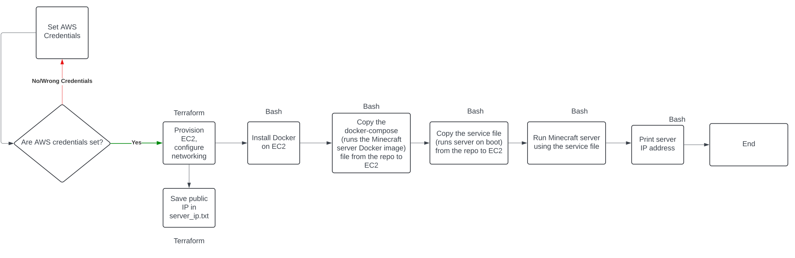

# Tutorial: How to create your own Minecraft server using Terraform, AWS EC2, Docker, and Bash.
Author: Ali Akturin

Course: CS 312 System Administration

Assignment: Course Project Part 2

## Background: What will we do? How will we do it?
Hi! In this tutorial, we will create an infrastructure that automatically starts a Minecraft server on an AWS EC2 instance with just a few commands! 

How will we do it?

We will use Hashicorp Terraform to set up our infrastructure. Terraform is an infrastructure as code tool that we will use to deploy our AWS EC2 instance. [Here's a link that explains what is Terraform](https://developer.hashicorp.com/terraform/intro)

Then we will use our bash script to configure our EC2 instance and run a Minecraft Server using Docker Container. [Here's the link to the docker image](https://hub.docker.com/r/itzg/minecraft-server)

That's it!
## Requirements
To run the scripts, you will need to have the following:
1. You will need your AWS account's credentials stored in ~/.aws/credentials file
2. Have Terraform CLI installed on your machine
3. You will need to create a pair of ssh keys and store them in ~/.ssh/mc_server_auto file
4. Have AWS CLI installed on your machine

## Major steps



## List of commands to run

### Installing AWS CLI
Refer to this page to install AWS CLI
[Installation Guide Link](https://docs.aws.amazon.com/cli/latest/userguide/getting-started-install.html)


### Installing Terraform CLI
Refer to this page to install Terraform CLI based on your OS
[Installation Guide Link](https://developer.hashicorp.com/terraform/tutorials/aws-get-started/install-cli)

### Configuring AWS Credentials

If you don't already have an .aws folder, create it using:
```
mkdir ~/.aws
```

Then, create your credentials file from the **.aws directory** using:

```
vim credentials
```

Copy your credentials into the file and save it, your file should look like this:

```
[default]
aws_access_key_id     =  your_aws_access_key_id
aws_secret_access_key =  your_aws_access_key
aws_session_token     =  your_session_token
```

### Creating SSH keys

Run this command to generate ssh keys.
```
ssh-keygen
```

When asked: **Enter file in which to save key**, type **mc_server_auto**. This will generate private and public keys of your EC2 instance. Terraform scripts is already set up to use keys defined in **~/.ssh/mc_server_auto**

When asked: **Enter passphrase (empty for no passphrase):**, press **Enter**

You will see this:
```
Enter file in which to save the key (/Users/aliakturin/.ssh/id_rsa): mc_server_auto
Enter passphrase (empty for no passphrase): 
Enter same passphrase again: 
```

### Once you have cloned the repo, run the following commands from the repo. Type Yes to all prompts.

This command will download all required plugins for Terraform to provision our AWS EC2 instance, set up an elastic IP for our server, and configure networking.
```
terraform init
```

This will run the Terraform script to provision our AWS EC2 instance
```
terraform apply
```

This command will run the bash script, which installs docker on our EC2 instance, creates a systemd service file that makes the server run on boot, and runs a Docker container that starts a Minecraft Server on the EC2 instance. This command will also print the server's IP address.
Answer
```
bash deploy_mc_server.bash    
```

**Congratulations! Your Minecraft server is set up. Give it a minute or two to start. Thank you for following my tutorial🦫**
## How to connect to the Minecraft server once it's running?
After you've run all scripts, the public IP of your Minecraft server will be stored in **server_ip.txt** file. Copy it and connect to the server using a Minecraft launcher.

## Resources I used to complete this project

1. [Managing AWS Security Groups Through Terraform](https://spacelift.io/blog/terraform-security-group)
2. [Ansible vs Terraform Reddit discussion](https://www.reddit.com/r/devops/comments/1b6hnqt/ansible_vs_terraform/)
3. [itzg Docker minecraft image](https://hub.docker.com/r/itzg/minecraft-server)
4. [StackOverflow - Launch docker automatically when starting ec2 server](https://stackoverflow.com/questions/63317771/launch-docker-automatically-when-starting-ec2-server)

